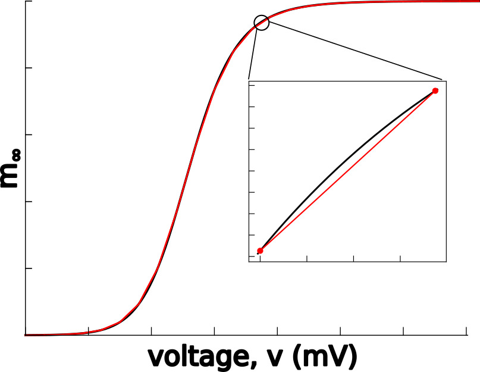

# LookUp Table approximator for [Brian2](https://briansimulator.org/) simulator

### What is Brian?
Brian is a free, open source simulator for spiking neural networks. It is written in the Python programming language and is available on almost all platforms. We believe that a simulator should not only save the time of processors, but also the time of scientists. Brian is therefore designed to be easy to learn and use, highly flexible and easily extensible.

### What is Lookup table approximation?
The lookup-table approximation is a classical method for computation acceleration in a numerical problem, known for centuries. 
It is extensively used in such software as NEURON and GENESIS, but I kind of miss it in Brian. 
This approximation is based on a straightforward algorithm: 
First, before simulation, one needs to precompute lookup tables for values of $m_\infty(v)$, $h_\infty(v)$, and so on in a full range of voltages. 
Usually, this range goes between the lowest possible to the highest possible voltages.
The range is divided into intervals with constant steps.
For example, this may be a range from −100 to 60 mV with 1 mV step. 
With precomputed tables, one solves differential equations using linear interpolation between table rows instead of computing exponential functions. 
The voltage at a current time moment of a numerical solution is used to find indices of two rows in the lookup table closest to the membrane voltage.
Using these two indices, one can query values for all steady-states and time constants of gating variables and linearly interpolate between
these values - like this:



### How to use it in Brian2?
You need to install the module `lut4brian` first.
```bash
pip install lut4brian --user
```
In the code one needs to import the module and set up 4 critical module variables:

- lut4brian.Xmin - minimal value of index variable (voltage in the case of ion channels)
- lut4brian.Xmax - maximal value of the same variable
- lut4brian.dX   - and the step
- lut4brian.tbl  - is a `numpy` array with all your values. Rows are different variables ($m_\infty(v)$, $h_\infty(v)$, etc.). Columns are values for the index.

Here is an example of the code:

```python
from brian2 import *
from lut4brian import *

x=linspace(-100,50,151)

lut4brian.Xmin = -100.
lut4brian.Xmax =   50.
lut4brian.dX   =    1.


alpha_m = 0.1*10./exprel(-(x+35.)/(10.))
beta_m  = 4*exp(-(x+60.)/(18.))
minf    = alpha_m/(alpha_m+beta_m)

alpha_h = 0.07*exp(-(x+58.)/(20.))
beta_h  = 1./(exp(-0.1*(x+28.))+1.)
htau    = 1./(alpha_h+beta_h)
hinf    = alpha_h*htau

alpha_n = 0.01*10/exprel(-(x+34.)/(10.))
beta_n  = 0.125*exp(-(x+44.)/(80.))
ntau    = 1./(alpha_n+beta_n)
ninf    = alpha_n*ntau

lut4brian.tbl = array([minf,hinf,htau,ninf,ntau])
```
The table `lut4brian.tbl` has shape, in this case, `(5, 151)` - 5 variables tabled for 151 points each

For `cpp_standalone` and `cython` targets, one _needs to create the table on the level of C-code/Cython_ - simple, just call
```python
lutinit()
```
this will create `lut4brian.c` in your current directory. After that tables can be deleted to release memory.

Now, in equation section one can pool interpolation values right out of the table:
```python
neurons = NeuronGroup(1000, 
'''
dv/dt = (-gNa*minf**3*h*(v-ENa)-gK*n**4*(v-EK)-gL*(v-EL)+I+b*gsyn*(Esyn-v))/Cm : volt
minf    = lutinterpol(v/mV,0) : 1
hinf    = lutinterpol(v/mV,1) : 1
htau    = lutinterpol(v/mV,2) : 1
ninf    = lutinterpol(v/mV,3) : 1
ntau    = lutinterpol(v/mV,4) : 1
dh/dt   = 5*(hinf-h)/htau/ms  : 1
dn/dt   = 5*(ninf-n)/ntau/ms  : 1
db/dt   = -b/taus             : 1
I : amp
''' , threshold="v>0.*mV", refractory="v>0.*mV", method='euler')

```
The `lutinterpol` function uses voltage to compute index in the table and returns interpolation value.
Note we added individual tables in this order `minf,hinf,htau,ninf,ntau` and fetch variables by corresponding 'curve index' - the second argument of the `lutinterpol()` function.

### Does it work faster than direct computations?

Ya! Check it out. In test directory there are a few benchmarks.

|       | Original   | Lookup table                 |
|:-----:|:----------:|:----------------------------:|
|Cython |22 s        |15s
|CPP standalone (single core) | 53s | 21s |

*I haven't checked `numpy` implementation yet*
